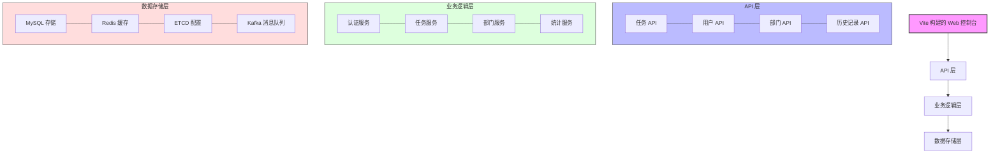

# DistributedJob - 项目结构文档

## 架构设计

### 概述

DistributedJob 采用模块化设计，围绕几个核心组件构建，这些组件共同协作，提供可靠且可扩展的分布式调度系统。系统现已支持 RPC 通信，增强了组件间的通信效率与可靠性。同时，我们新增了 AI 能力模块，包括 Agent 智能代理、MCP 模型上下文协议和 RAG 检索增强生成功能，进一步提升系统的智能化水平。

项目实现了高效的 10 天快速开发周期，通过模块化设计、代码生成工具、预构建组件和自动化工作流，显著缩短开发时间，确保高质量交付。详细的快速开发方法请参考 [快速开发指南](rapid_development.md)。

### 项目结构

```
distributedJob/
├── cmd/                  # 命令行应用程序入口点
│   └── main.go           # 服务入口点
├── configs/              # 配置文件目录
│   ├── config.yaml       # 主配置文件
│   └── prometheus/       # Prometheus 相关配置
│       └── prometheus.yml # Prometheus 配置文件
├── docs/                 # 文档目录
│   ├── ai_features.md    # AI 功能文档
│   ├── services.md       # 服务文档
│   ├── structure.md      # 项目结构文档
│   └── ui.md             # UI 文档
├── internal/             # 私有应用程序和库代码
│   ├── agent/            # 智能代理模块
│   │   ├── core/         # 代理核心实现
│   │   ├── tools/        # 代理可用工具集
│   │   ├── config/       # 代理配置
│   │   └── types/        # 类型定义
│   ├── api/              # API 相关代码
│   │   ├── server.go     # API 服务器
│   │   ├── handler/      # HTTP 处理器
│   │   │   ├── agent_handler.go   # 智能代理处理器
│   │   │   ├── dashboard_handler.go # 仪表盘处理器
│   │   │   ├── health_handler.go    # 健康检查处理器
│   │   │   ├── mcp_handler.go       # MCP 处理器
│   │   │   └── rag_handler.go       # RAG 处理器
│   │   └── middleware/   # HTTP 中间件
│   │       ├── cors.go          # 跨域请求中间件
│   │       ├── instrumentation.go # 监控中间件
│   │       ├── jwt_auth.go      # JWT 认证中间件
│   │       ├── logger.go        # 日志中间件
│   │       └── tracing.go       # 链路追踪中间件
│   ├── config/           # 配置管理
│   │   ├── config.go      # 配置结构和加载逻辑
│   │   └── extended_config.go # 扩展配置
│   ├── infrastructure/   # 基础设施
│   │   └── infrastructure.go # 基础设施初始化和管理
│   ├── job/              # 核心任务调度模块
│   │   ├── scheduler.go   # 任务调度器
│   │   ├── http_worker.go # HTTP 任务执行器
│   │   ├── grpc_worker.go # gRPC 任务执行器
│   │   ├── options.go     # 调度器选项
│   │   └── stats.go       # 任务统计
│   ├── mcp/              # 模型上下文协议模块
│   │   ├── client/        # MCP 客户端实现
│   │   ├── context/       # 上下文管理
│   │   ├── protocol/      # 协议定义
│   │   └── stream/        # 流处理
│   ├── model/            # 数据模型
│   │   └── entity/       # 业务实体对象
│   │       ├── department.go    # 部门实体
│   │       ├── permission.go    # 权限实体
│   │       ├── record.go        # 执行记录实体
│   │       ├── role_permission.go # 角色权限关系实体
│   │       ├── role.go          # 角色实体
│   │       ├── task.go          # 任务实体
│   │       └── user.go          # 用户实体
│   ├── rag/              # 检索增强生成模块
│   │   ├── vectorstore/   # 向量存储实现
│   │   ├── document/      # 文档处理
│   │   ├── retriever/     # 检索实现
│   │   ├── generator/     # 增强生成器
│   │   └── embedding/     # 嵌入模型
│   ├── rpc/              # RPC 服务相关代码
│   │   ├── client/       # RPC 客户端实现
│   │   ├── proto/        # Protocol Buffers 定义
│   │   │   ├── agent.proto       # 智能代理服务定义
│   │   │   ├── auth.proto        # 认证服务定义
│   │   │   ├── data.proto        # 数据服务定义
│   │   │   ├── mcp.proto         # MCP 服务定义
│   │   │   ├── rag.proto         # RAG 服务定义
│   │   │   └── scheduler.proto   # 调度器服务定义
│   │   └── server/       # RPC 服务器实现
│   │       ├── agent_service_server.go  # 智能代理服务实现
│   │       ├── auth_service_server.go   # 认证服务实现
│   │       ├── data_service_server.go   # 数据服务实现
│   │       ├── mcp_service_server.go    # MCP 服务实现
│   │       ├── rag_service_server.go    # RAG 服务实现
│   │       ├── rpc_server.go            # RPC 服务器基础结构
│   │       └── task_scheduler_server.go # 任务调度服务实现
│   ├── service/          # 业务逻辑服务
│   │   ├── agent_service.go # 智能代理服务实现
│   │   ├── auth_service.go  # 认证服务实现
│   │   ├── init_service.go  # 初始化服务
│   │   ├── mcp_service.go   # MCP 服务实现
│   │   ├── rag_service.go   # RAG 服务实现
│   │   └── task_service.go  # 任务服务实现
│   └── store/            # 存储层
│       ├── repository.go    # 存储接口定义
│       ├── token_revoker.go # 令牌撤销接口
│       ├── etcd/            # ETCD 存储实现
│       │   └── manager.go   # ETCD 管理器
│       ├── kafka/           # Kafka 存储实现
│       │   └── manager.go   # Kafka 管理器
│       ├── mysql/           # MySQL 实现
│       │   ├── manager.go   # MySQL 连接管理
│       │   └── repository/  # 数据访问对象
│       │       ├── department_repository.go # 部门仓库
│       │       ├── permission_repository.go # 权限仓库
│       │       ├── role_repository.go      # 角色仓库
│       │       ├── task_repository.go      # 任务仓库
│       │       └── user_repository.go      # 用户仓库
│       ├── redis/           # Redis 实现
│       │   ├── manager.go      # Redis 连接管理
│       │   └── token_revoker.go # 基于 Redis 的令牌撤销
│       └── vector/          # 向量存储实现
│           ├── manager.go      # 向量存储管理
│           └── postgres.go     # PostgreSQL 向量存储
├── pkg/                  # 可被外部应用程序使用的库
│   ├── ai/               # AI 工具库
│   │   ├── embedding.go  # 嵌入工具
│   │   ├── llm.go        # 语言模型接口
│   │   └── tokenizer.go  # 分词工具
│   ├── logger/           # 日志工具
│   │   ├── context.go    # 日志上下文
│   │   └── logger.go     # 日志实现
│   ├── memory/           # 内存相关工具
│   │   └── token_revoker.go # 内存令牌撤销实现
│   ├── metrics/          # 指标监控
│   │   ├── gauge_getter.go # 度量值获取
│   │   └── metrics.go      # 指标监控实现
│   ├── session/          # 会话管理
│   └── tracing/          # 分布式追踪
│       └── tracer.go     # 追踪器实现
├── scripts/              # 构建和部署脚本
│   └── init-db/          # 数据库初始化
│       └── init.sql      # 初始化 SQL 脚本
├── web-ui/               # 前端应用 (Vite 构建)
│   ├── src/              # 源代码
│   │   ├── api/          # API 客户端
│   │   ├── components/   # UI 组件
│   │   ├── router/       # 路由管理
│   │   ├── store/        # 状态管理
│   │   └── views/        # 页面视图
│   ├── index.html        # 入口 HTML
│   └── vite.config.ts    # Vite 配置
├── go.mod                # Go 模块依赖
├── go.sum                # Go 模块校验和
└── docker-compose.yml    # Docker Compose 配置
```

### 组件图



### 装饰器模式架构

DistributedJob 使用装饰器模式重构了核心组件，以实现功能的动态组合和扩展。装饰器模式是一种结构型设计模式，允许在不修改原有代码的情况下，通过包装对象动态添加新的行为。

#### 装饰器模式文件结构

装饰器模式的实现添加了以下新文件:

```
internal/
├── job/
│   ├── worker.go             # 定义Worker接口和基础装饰器
│   ├── worker_decorators.go  # 实现各种具体的装饰器
│   ├── http_worker.go        # 实现HTTP Worker (被装饰对象)
│   └── grpc_worker.go        # 实现GRPC Worker (被装饰对象)
└── store/
    ├── repository.go         # 定义Repository接口
    └── repository_decorators.go # 实现Repository的装饰器
```

#### 装饰器组合示例

在系统中，通过装饰器模式可以灵活组合各种横切关注点:

```go
// 创建基础HTTP Worker
baseWorker := NewHTTPWorker(config.Workers, jobQueue)

// 使用装饰器动态添加功能
var worker Worker = baseWorker
worker = NewLoggingWorkerDecorator(worker)         // 添加日志
worker = NewMetricsWorkerDecorator(worker, metrics) // 添加指标监控
worker = NewTracingWorkerDecorator(worker, tracer)  // 添加分布式追踪
worker = NewRetryWorkerDecorator(worker, 3, 5*time.Second) // 添加重试逻辑

// 启动装饰后的worker
worker.Start(ctx)
```

#### 装饰器模式改造优势

1. **关注点分离** - 每个装饰器只处理一种特定的横切关注点，如日志、监控、重试等
2. **灵活组合** - 可以在运行时动态组合不同的装饰器，实现功能的自由搭配
3. **代码复用** - 装饰器可以被多种 Worker 类型共享使用
4. **遵循开闭原则** - 可以不修改现有代码而添加新功能
5. **提高可测试性** - 可以单独测试每个装饰器

#### 装饰器应用场景

系统中的装饰器模式主要应用在以下场景:

1. **Worker 系统** - 为任务执行器添加日志、监控、重试、分布式追踪等功能
2. **Repository 层** - 为数据访问层添加缓存、事务、指标收集等功能
3. **API 中间件** - 作为 HTTP 请求的处理中间件实现认证、限流等功能
4. **日志系统** - 为日志器添加格式化、过滤、路由等增强功能

### 工作流程

1. **用户请求流**

   - 用户通过 Web 控制台发起请求
   - API 层接收请求并验证认证信息
   - 业务逻辑层处理请求
   - 数据存储层提供持久化
   - 响应返回给用户

2. **任务调度流**

   - 定时触发器激活预定任务
   - 调度器从数据库加载任务配置
   - 根据任务类型选择执行器
   - 执行任务并记录结果
   - 更新任务状态和统计信息

3. **RPC 通信流**

   - 服务间通过 gRPC 协议通信
   - 使用 Protocol Buffers 序列化数据
   - 支持请求/响应和流式传输模式
   - 提供服务发现和负载均衡

### 设计原则

1. **模块化设计**

   - 通过明确的接口分离关注点
   - 提高代码可维护性和可测试性
   - 便于独立开发和部署

2. **可扩展性**

   - 支持水平扩展各组件
   - 插件化架构允许自定义扩展
   - 使用消息队列解耦组件

3. **弹性与容错**

   - 优雅处理服务故障
   - 实现任务重试机制
   - 使用断路器防止级联失败

4. **可观察性**

   - 全面的日志记录
   - 详细的指标监控
   - 分布式追踪支持

### 数据库设计

#### 数据库概述

系统使用 MySQL 作为主要数据存储，Redis 用于缓存和令牌管理，ETCD 用于配置中心，Kafka 用于消息队列。

#### 表结构设计

1. **users 表** - 存储用户信息

   - id: 唯一标识符
   - username: 用户名
   - password_hash: 密码哈希
   - email: 电子邮件
   - department_id: 所属部门 ID
   - created_at: 创建时间
   - updated_at: 更新时间
   - last_login: 最后登录时间

2. **departments 表** - 存储部门信息

   - id: 唯一标识符
   - name: 部门名称
   - description: 部门描述
   - parent_id: 父部门 ID（自引用）
   - created_at: 创建时间
   - updated_at: 更新时间

3. **roles 表** - 存储角色信息

   - id: 唯一标识符
   - name: 角色名称
   - description: 角色描述
   - created_at: 创建时间
   - updated_at: 更新时间

4. **permissions 表** - 存储权限信息

   - id: 唯一标识符
   - name: 权限名称
   - description: 权限描述
   - resource: 资源类型
   - action: 操作类型
   - created_at: 创建时间
   - updated_at: 更新时间

5. **role_permissions 表** - 角色权限关联

   - role_id: 角色 ID
   - permission_id: 权限 ID
   - created_at: 创建时间

6. **user_roles 表** - 用户角色关联

   - user_id: 用户 ID
   - role_id: 角色 ID
   - created_at: 创建时间

7. **tasks 表** - 存储任务配置

   - id: 唯一标识符
   - name: 任务名称
   - description: 任务描述
   - cron_expression: cron 表达式
   - task_type: 任务类型（HTTP/GRPC）
   - target: 目标 URL 或服务
   - method: 方法（GET/POST 等）
   - headers: 请求头（JSON 格式）
   - body: 请求体
   - timeout: 超时时间（秒）
   - retry_count: 重试次数
   - retry_interval: 重试间隔（秒）
   - created_by: 创建者 ID
   - created_at: 创建时间
   - updated_at: 更新时间
   - status: 任务状态

8. **execution_records 表** - 存储任务执行记录

   - id: 唯一标识符
   - task_id: 任务 ID
   - start_time: 开始时间
   - end_time: 结束时间
   - status: 执行状态
   - result: 执行结果
   - error: 错误信息

### 安装指南

#### 系统要求

- Go 1.20 或更高版本
- MySQL 8.0 或更高版本
- Redis 6.0 或更高版本
- Node.js 18 或更高版本（用于前端开发）
- Docker 和 Docker Compose（用于容器化部署）

#### 安装方法

1. **克隆代码库**

   ```bash
   git clone https://github.com/yourusername/distributedJob.git
   cd distributedJob
   ```

2. **编译服务**

   ```bash
   go build -o bin/distributedJob cmd/main.go
   ```

3. **安装前端依赖**

   ```bash
   cd web-ui
   npm install
   npm run build
   cd ..
   ```

#### 配置

1. **修改配置文件**
   ```bash
   cp configs/config.example.yaml configs/config.yaml
   # 编辑 configs/config.yaml 设置数据库连接等参数
   ```

#### 数据库设置

1. **使用 SQL 脚本初始化数据库**
   ```bash
   mysql -u root -p < scripts/init-db/init.sql
   ```

#### 运行服务

1. **直接运行**

   ```bash
   ./bin/distributedJob
   ```

2. **使用 Docker Compose**

   ```bash
   docker-compose up -d
   ```

#### 验证

访问 http://localhost:8080 验证服务是否正常运行。

#### 部署选项

1. **单机部署** - 适合开发和测试环境
2. **Docker 部署** - 使用 docker-compose 快速部署完整环境
3. **Kubernetes 部署** - 适合生产环境，提供高可用性和扩展性

<style>#mermaid-1747126803627{font-family:sans-serif;font-size:16px;fill:#333;}#mermaid-1747126803627 .error-icon{fill:#552222;}#mermaid-1747126803627 .error-text{fill:#552222;stroke:#552222;}#mermaid-1747126803627 .edge-thickness-normal{stroke-width:2px;}#mermaid-1747126803627 .edge-thickness-thick{stroke-width:3.5px;}#mermaid-1747126803627 .edge-pattern-solid{stroke-dasharray:0;}#mermaid-1747126803627 .edge-pattern-dashed{stroke-dasharray:3;}#mermaid-1747126803627 .edge-pattern-dotted{stroke-dasharray:2;}#mermaid-1747126803627 .marker{fill:#333333;}#mermaid-1747126803627 .marker.cross{stroke:#333333;}#mermaid-1747126803627 svg{font-family:sans-serif;font-size:16px;}#mermaid-1747126803627 g.classGroup text{fill:#9370DB;fill:#131300;stroke:none;font-family:sans-serif;font-size:10px;}#mermaid-1747126803627 g.classGroup text .title{font-weight:bolder;}#mermaid-1747126803627 .node rect,#mermaid-1747126803627 .node circle,#mermaid-1747126803627 .node ellipse,#mermaid-1747126803627 .node polygon,#mermaid-1747126803627 .node path{fill:#ECECFF;stroke:#9370DB;stroke-width:1px;}#mermaid-1747126803627 .divider{stroke:#9370DB;stroke:1;}#mermaid-1747126803627 g.clickable{cursor:pointer;}#mermaid-1747126803627 g.classGroup rect{fill:#ECECFF;stroke:#9370DB;}#mermaid-1747126803627 g.classGroup line{stroke:#9370DB;stroke-width:1;}#mermaid-1747126803627 .classLabel .box{stroke:none;stroke-width:0;fill:#ECECFF;opacity:0.5;}#mermaid-1747126803627 .classLabel .label{fill:#9370DB;font-size:10px;}#mermaid-1747126803627 .relation{stroke:#333333;stroke-width:1;fill:none;}#mermaid-1747126803627 .dashed-line{stroke-dasharray:3;}#mermaid-1747126803627 #compositionStart,#mermaid-1747126803627 .composition{fill:#333333 !important;stroke:#333333 !important;stroke-width:1;}#mermaid-1747126803627 #compositionEnd,#mermaid-1747126803627 .composition{fill:#333333 !important;stroke:#333333 !important;stroke-width:1;}#mermaid-1747126803627 #dependencyStart,#mermaid-1747126803627 .dependency{fill:#333333 !important;stroke:#333333 !important;stroke-width:1;}#mermaid-1747126803627 #dependencyStart,#mermaid-1747126803627 .dependency{fill:#333333 !important;stroke:#333333 !important;stroke-width:1;}#mermaid-1747126803627 #extensionStart,#mermaid-1747126803627 .extension{fill:#333333 !important;stroke:#333333 !important;stroke-width:1;}#mermaid-1747126803627 #extensionEnd,#mermaid-1747126803627 .extension{fill:#333333 !important;stroke:#333333 !important;stroke-width:1;}#mermaid-1747126803627 #aggregationStart,#mermaid-1747126803627 .aggregation{fill:#ECECFF !important;stroke:#333333 !important;stroke-width:1;}#mermaid-1747126803627 #aggregationEnd,#mermaid-1747126803627 .aggregation{fill:#ECECFF !important;stroke:#333333 !important;stroke-width:1;}#mermaid-1747126803627:root{--mermaid-font-family:sans-serif;}#mermaid-1747126803627:root{--mermaid-alt-font-family:sans-serif;}#mermaid-1747126803627 class{fill:apa;}</style>
